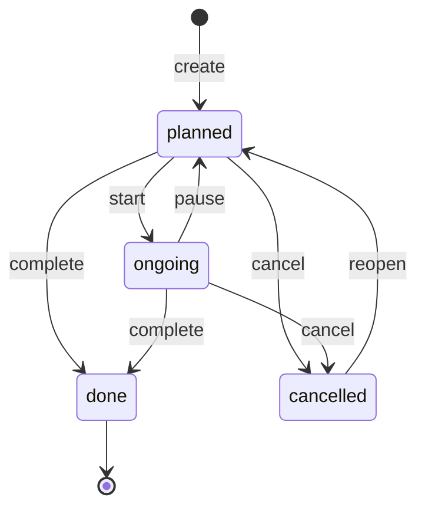
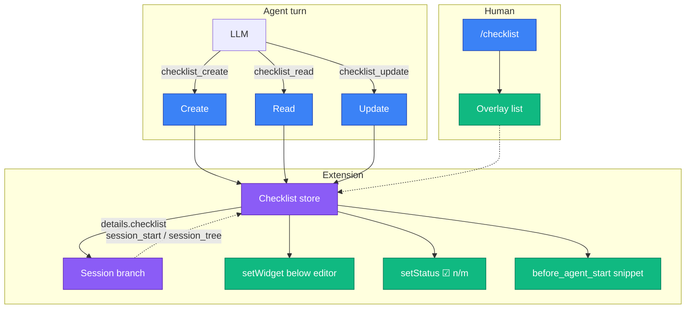
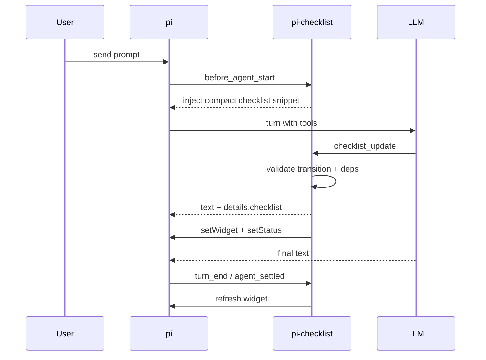

# Plan 001 — pi-checklist extension

**Status:** done (implemented 2026-09-12; TUI eyeball still open)
**Goal:** Ship a pi extension that lets the agent maintain a session-scoped task checklist with dependencies, and show that list in the TUI after every turn.

## Why this exists

Pi already has two nearby examples — `todo.ts` (stateful tool + overlay) and `plan-mode` (widget + footer during execution) — but neither is a first-class *working checklist* for the current coding session:

- `todo.ts` is a single `todo` tool with CRUD actions, no dependencies, no status machine, no always-on widget.
- `plan-mode` extracts steps from a plan file and is tied to a read-only planning workflow.

`pi-checklist` is the agent’s scratch pad for “what am I doing this session”: create a list, read it, walk tasks through `planned → ongoing → done/cancelled`, honor `dependsOn`, and keep the human looking at a live TUI list.

## Design

### Data model

```ts
type TaskStatus = "planned" | "ongoing" | "done" | "cancelled";

interface Task {
  id: string;              // exactly 3 chars, [a-z0-9], assigned at create, frozen
  title: string;           // required, short
  notes?: string;          // optional extra context for the agent
  status: TaskStatus;
  dependsOn: string[];     // 3-char task ids that must be `done` before this may become `ongoing`
  createdAt: number;
  updatedAt: number;
}

interface Checklist {
  title?: string;          // optional session/goal name, shown in the widget header
  tasks: Task[];
  updatedAt: number;
}
```

`dependsOn` is always an array. A single dependency is `[ "k7q" ]`. Empty array = unblocked (aside from its own status). No `nextId` counter — ids come from a title hash (see below).

### Task ids (3-character alphanumeric)

Every task id is **exactly 3 characters**, alphabet `[0-9a-z]`, stored lowercase. Pattern: `/^[a-z0-9]{3}$/`. Space is 36³ = 46,656; a session list of ~20 tasks collides with negligible probability, and we still disambiguate.

**Generate by hashing the title** (not random, not sequential). Deterministic, no extra dependency, no counter to persist:

```ts
const ALPHABET = "0123456789abcdefghijklmnopqrstuvwxyz"; // 36

function fnv1a(s: string): number {
  let h = 0x811c9dc5;
  for (let i = 0; i < s.length; i++) {
    h ^= s.charCodeAt(i);
    h = Math.imul(h, 0x01000193);
  }
  return h >>> 0;
}

function encode3(n: number): string {
  let x = n >>> 0;
  let out = "";
  for (let i = 0; i < 3; i++) {
    out = ALPHABET[x % 36] + out;
    x = Math.floor(x / 36);
  }
  return out;
}

function allocId(title: string, used: Set<string>): string {
  const key = title.toLowerCase().replace(/[^a-z0-9]+/g, " ").trim();
  for (let salt = 0; salt < 64; salt++) {
    const id = encode3(fnv1a(salt === 0 ? key : `${key}\0${salt}`));
    if (!used.has(id)) return id;
  }
  throw new Error("could not allocate a free 3-char id");
}
```

Rules:

- **Hash the normalized title only**, never status/notes — otherwise ids would move. Id is assigned at create time and **frozen** (a later title edit does not rehash).
- **Caller-supplied `id`** is optional. If present it must match `/^[a-z0-9]{3}$/i`, is lowercased, and must be unique. Use this when creating a DAG in one `checklist_create` call so `dependsOn` can name siblings the agent already chose.
- If `id` is omitted, `allocId(title, used)` fills it in. Two-pass create: allocate every id first (explicit then hashed), then resolve `dependsOn` against that set plus any existing tasks (append mode).
- Duplicate ids are rejected. Unknown / wrong-shape `dependsOn` ids are rejected. `dependsOn` values are lowercased at the tool boundary.
- **Do not invent ids in the LLM.** Prompt guidelines: copy the 3-char codes returned by `checklist_create` / `checklist_read`. Never guess the hash.
- No crypto (`SHA-256` / Web Crypto) — FNV-1a is enough, sync, and keeps `store.ts` dependency-free.
- Skip reserved words that are also valid 3-char ids if they would confuse the command parser later (`all` is the only likely one; reject `all` as an id).

### Status state machine



| From | To | Guard |
|---|---|---|
| `planned` | `ongoing` | every `dependsOn` id exists and is `done` |
| `planned` | `done` | same guard (shortcut for tiny tasks) |
| `planned` | `cancelled` | none |
| `ongoing` | `done` | none |
| `ongoing` | `cancelled` | none |
| `ongoing` | `planned` | none (pause; still blocked if deps later regress — they shouldn't) |
| `cancelled` | `planned` | none (reopen) |
| `done` | — | **terminal in v1** |

Illegal transitions return an error (no mutation). `done` cannot be reopened in v1 — keep the machine small; agents can create a new task if work comes back.

Additional rules:

- **Multiple `ongoing` allowed**, but prompt guidelines tell the agent to keep at most one (or a tight parallel set).
- **Cancelled dependencies block dependents.** If `k7q` is `cancelled`, `m2n` depending on `k7q` cannot start. The agent must cancel `m2n`, retarget `dependsOn`, or reopen `k7q`.
- **Cycles are rejected** on create and on `dependsOn` edits (DFS).
- **Unknown `dependsOn` ids are rejected.**
- A task cannot depend on itself.

Computed views (not stored):

- `ready`: `status === "planned"` and all deps `done`
- `blockedBy`: list of dep ids that are not `done`
- `blocked`: `blockedBy.length > 0`

### Tools (three, not one)

Separate tools so the LLM can pick the right verb without an `action` enum.

#### 1. `checklist_create`

Create or extend the session list.

```ts
{
  title?: string;
  mode?: "replace" | "append";   // default "replace"
  tasks: Array<{
    id?: string;
    title: string;
    notes?: string;
    dependsOn?: string | string[];  // coerce a single string to [string]
  }>;
}
```

- `replace` (default): wipe the current list and install this one. Empty `tasks` = clear.
- `append`: add tasks; new ids are hashed against the existing used-id set. `dependsOn` may point at existing ids.
- New tasks always start as `planned`.
- Two-pass id assignment (explicit ids, then hashed titles), then `dependsOn` resolution.
- Returns a compact text summary **including every assigned 3-char id** so the LLM can copy them, plus a full `Checklist` snapshot in `details`.

`promptGuidelines`: use at the start of multi-step work; replace when the plan changes substantially; append when new work appears mid-session. Omit `id` unless you need a same-batch DAG — then pass explicit 3-char ids. Always copy returned ids; never invent them.

#### 2. `checklist_read`

```ts
{
  status?: TaskStatus;     // optional filter
  includeDone?: boolean;   // default true
}
```

Returns every task (or the filter) with `ready` / `blockedBy` computed. Always cheap. The agent should call this after compaction or when unsure; the TUI does not replace this — the model only sees tool results and any injected snippet.

#### 3. `checklist_update`

```ts
{
  updates: Array<{
    id: string;
    status?: TaskStatus;
    title?: string;
    notes?: string;
    dependsOn?: string | string[];
  }>;
}
```

- All-or-nothing: validate every update, then apply. Partial apply would leave the list lying to the widget.
- Status changes go through the transition table above.
- Title / notes / dependsOn edits are allowed on non-`done` tasks. `done` tasks are frozen.
- Returns the new snapshot + a line per change (`m2n planned → ongoing`).

`promptGuidelines`: mark `ongoing` before starting work; mark `done` as soon as the work is actually done; `cancel` tasks that the new plan made irrelevant; never start a task whose `blockedBy` is non-empty.

### Persistence (the session JSONL itself)

Yes — store the checklist **inside the session file**. That is the only durable, resume-safe, branch-safe place pi gives extensions.

Pi sessions are append-only JSONL trees:

```
~/.pi/agent/sessions/--<cwd-path>--/<timestamp>_<uuid>.jsonl
```

Each line is an entry with `id` / `parentId`. `/resume` reloads that file. `/branch` moves the leaf; it does **not** rewrite history. There is no extension API to hang a bag of data on the session header, and a sidecar file next to the repo would ignore branching and collide across sessions in the same cwd.

Two write channels, both land in the same JSONL:

| Channel | JSONL entry | In LLM context? | Why we use it |
|---|---|---|---|
| Tool result `details` | `{ type: "message", message: { role: "toolResult", toolName, details } }` | **No** (`content` is; `details` is metadata) | Official pattern (`extensions.md` → State Management, `examples/extensions/todo.ts`). Every agent mutation already produces a tool result, so the snapshot rides along for free. |
| `pi.appendEntry("pi-checklist", data)` | `{ type: "custom", customType: "pi-checklist", data }` | **No** | Same file, still on the tree (`parentId`). Needed for mutations that are **not** tool calls — `/checklist clear`, widget hide/show — and as a belt-and-braces snapshot after every tool mutation. No entry renderer → silent in the transcript. |

Do **not** use `sendMessage` / `custom_message` for the snapshot. That path *is* sent to the LLM and would burn tokens on every resume.

#### Snapshot shape

```ts
interface ChecklistSnapshot {
  v: 1;
  checklist: Checklist | null;  // null = cleared
  widgetVisible?: boolean;      // persist /checklist hide across resume
}
```

- Tool execute returns `details: snapshot` (also used by `renderResult`).
- Then `pi.appendEntry("pi-checklist", snapshot)` so human-only commands and tool mutations share one reconstruct path.
- In-memory `let state: ChecklistSnapshot` is the live copy the widget reads. Memory is a cache; the JSONL is the source of truth.

#### Reconstruct (always from the current branch)

Walk `ctx.sessionManager.getBranch()` **oldest → newest**, last matching snapshot wins:

```ts
function loadFromBranch(branch): ChecklistSnapshot {
  let found: ChecklistSnapshot = { v: 1, checklist: null };
  for (const entry of branch) {
    if (entry.type === "custom" && entry.customType === "pi-checklist" && entry.data?.v === 1) {
      found = entry.data;
    } else if (
      entry.type === "message" &&
      entry.message.role === "toolResult" &&
      CHECKLIST_TOOLS.has(entry.message.toolName) &&
      entry.message.details?.v === 1
    ) {
      found = entry.message.details;
    }
  }
  return found;
}
```

Use **`getBranch()`**, never `getEntries()`. `getEntries()` is the whole tree (other branches included); the docs example for `appendEntry` uses it and that is wrong for `/branch`. Re-run on `session_start` (covers `/resume`, startup) and `session_tree` (covers `/branch`, `/undo`).

#### Why this survives the things people worry about

- **`/resume`**: the JSONL is reloaded; `session_start` rebuilds memory from the branch tip.
- **`/branch` / `/undo`**: the leaf changes; `session_tree` rebuilds from *that* branch, so you get the snapshot that was true at that point in the tree, not the abandoned tip.
- **Compaction**: compaction **appends** a summary entry. It does not delete old JSONL lines. `getBranch()` still walks through pre-compaction tool results and custom entries, so the checklist is not lost. The *LLM* may forget it (old tool `content` is summarized) — that is why `before_agent_start` re-injects a compact snippet.
- **`/fork` / `/clone`**: new JSONL with copied entries (and `parentSession` in the header). Snapshots copy with the entries.
- **Print / ephemeral sessions**: if `getSessionFile()` is null, JSONL writes are no-ops; in-memory still works for that process. Acceptable.

#### What we will not do

- Sidecar `.pi/checklist.json` / cwd file — ignores branch and resume of a different session.
- `~/.pi/agent/checklist.json` global store — mixes projects.
- Session-header mutation — no extension API, and the header has no `id`/`parentId` so it cannot be branch-scoped.
- Replaying tool *arguments* to rebuild state — arguments are the intent, not the validated result (a rejected `ongoing` must not apply). Always persist the **post-mutation snapshot**.

### TUI

Three surfaces, all gated with `ctx.hasUI` / `ctx.mode === "tui"`:

#### A. Always-on widget (the “after each turn” renderer)

`ctx.ui.setWidget("checklist", lines, { placement: "belowEditor" })`.

Refresh:

- inside every tool `execute` (live during the tool loop)
- on `turn_end`
- on `agent_settled`
- after reconstruction on `session_start` / `session_tree`

Empty checklist → `setWidget("checklist", undefined)` (hide).

Suggested layout (theme tokens, no hardcoded hex):

```
checklist  3/8 done   1 ongoing   2 ready   2 blocked
● m2n  Implement parser          ongoing
○ b8t  Write unit tests          blocked ← m2n
○ w4c  Wire /checklist command   ready
✓ k7q  Scaffold package          done
✕ p0x  Publish to npm            cancelled
```

Rules:

- Sort: `ongoing`, then `ready` planned, then blocked planned, then `done`, then `cancelled`.
- Cap at ~16 lines; if longer, show `ongoing` + `ready` + `blocked` in full and collapse `done`/`cancelled` to a count (`✓ 5 done  ✕ 1 cancelled`).
- Truncate titles to the widget width; never wrap a task onto two lines.
- Widget is display-only (not focusable). Editing is via tools or `/checklist`.

#### B. Footer status

`ctx.ui.setStatus("checklist", "☑ 3/8")` — compact done/total, excluding `cancelled` from the denominator (cancelled is not remaining work). Clear when empty.

#### C. `/checklist` overlay

A `ctx.ui.custom(component, { overlay: true, overlayOptions: { width, maxHeight, anchor: "center" } })` component, modelled on `todo.ts`:

- Lists all tasks with status glyphs and dep hints.
- Keys: `j`/`k` or arrows to move, `Escape` / `q` to close.
- Optional args:
  - `/checklist` — open overlay
  - `/checklist hide` | `/checklist show` — toggle the widget without clearing state
  - `/checklist clear` — confirm, then empty the list (also a way for the human to bail)

No in-overlay editing in v1. The agent owns mutations; the human inspects.

#### D. Tool transcript renderers

Custom `renderCall` / `renderResult` so the chat does not dump JSON:

- create: `checklist create  6 tasks`
- read: `checklist  3/8 done`
- update: `checklist  m2n planned → ongoing`

Use `theme.fg("accent"|"success"|"warning"|"error", …)` / `theme.bold`.

### Agent guidance

On each tool:

- `promptSnippet`: one-liner (`Create or replace the session task checklist.`).
- `promptGuidelines`: when to call, the state machine, the dep rule, “keep at most one ongoing”.

On `before_agent_start`, if the checklist is non-empty, inject a **short** system snippet (not the full notes) so compaction cannot make the agent forget the list:

```
Current checklist (3/8 done): m2n ongoing "Implement parser"; ready: w4c; blocked: b8t ← m2n.
Use checklist_update as work progresses. Do not start blocked tasks. Copy 3-char ids; never invent them.
```

Skip the injection when empty so we do not spend tokens on idle sessions.

## Architecture



Turn lifecycle:



## Package shape

Follow sibling extensions (`pi-speedometer`, `pi-subscription-meter`):

```
pi-checklist/
├── package.json
├── src/
│   ├── index.ts       # export default function (pi) { ... }  wire events, tools, command
│   ├── types.ts       # TaskStatus, Task, Checklist, tool params
│   ├── store.ts       # create/append/update, transitions, cycle check, reconstruct
│   ├── tools.ts       # Type.Object schemas + execute + guidelines
│   ├── render.ts      # widget lines, footer text, tool renderers, overlay component
│   └── commands.ts    # /checklist
├── README.md
└── AGENTS.md
```

`package.json` essentials:

- `"name": "pi-checklist"` — check npm; if taken, `@championswimmer/pi-checklist` with `"publishConfig": { "access": "public" }`
- `"type": "module"`, `"main"` / `"exports"` → `./src/index.ts`
- `"keywords": ["pi-package"]`
- `"pi": { "extensions": ["./src/index.ts"] }`  (confirm current packages.md key; siblings use this)
- `peerDependencies`: `@earendil-works/pi-coding-agent`, `@earendil-works/pi-ai`, `@earendil-works/pi-tui`, `typebox` all `"*"`
- no runtime `dependencies` if we stay on the four provided modules
- `"engines": { "node": ">=20" }`
- `repository` / `bugs` / `homepage` pointing at `https://github.com/championswimmer/pi-checklist`

No build step. Type-only imports from pi packages.

Keep `store.ts` free of `pi` / TUI imports so transitions can be unit-tested with `node:test` later without booting the agent. v1 may skip a test runner if time is tight, but the module boundary is cheap and should exist from the start.

## Implementation steps

1. **Manifest.** Add `package.json` (and MIT `LICENSE` to match siblings). Do not publish.
2. **Types + store.** Implement the state machine, FNV-1a 3-char id allocation, cycle detection, `ready`/`blockedBy`, replace/append, reconstruct-from-branch helper (pure: takes an array of `{ toolName, details }`).
3. **Tools.** Register `checklist_create`, `checklist_read`, `checklist_update` with TypeBox params, guidelines, snippets, `details` snapshots, and compact `content` text.
4. **TUI render.** Widget lines, footer, tool renderers. Call `refreshUi()` from execute + `turn_end` + `agent_settled`.
5. **`/checklist` command.** Overlay + `show`/`hide`/`clear`.
6. **Session events.** `session_start` / `session_tree` reconstruct then refresh. `before_agent_start` injects the compact snippet when non-empty.
7. **Docs.** Fill in README (tools table, glyphs, `/checklist`, install). Tick AGENTS.md status. Note any API drift vs this plan.
8. **Smoke.** `pi -e ./src/index.ts -p "Create a 3-step checklist for adding a README section, then mark the first done."` in print mode (tools must round-trip). Then a TUI session to confirm widget + footer + `/checklist`.

## Verification

- Create 4 tasks where `b8t` depends on `m2n` and `m2n` on `k7q` (explicit ids). `checklist_read` shows `k7q` ready, `m2n`/`b8t` blocked.
- `m2n → ongoing` while `k7q` is planned **fails**.
- `k7q → ongoing → done`, then `m2n → ongoing` **succeeds**.
- Cancel `k7q` after reopen-from-planned: dependents stay blocked; updating `m2n → ongoing` still fails; cancelling `m2n` succeeds.
- Cycle `k7q dependsOn m2n, m2n dependsOn k7q` rejected on create.
- Omitting `id` yields a stable 3-char hash of the title; hashing the same title twice in one list salts and gets a different id.
- `mode: "append"` keeps existing tasks and hashes new titles against the used-id set.
- Reject ids that are not exactly 3 alphanumeric chars (`scaffold`, `t1`, `AB`).
- `/branch` to a parent that had an older snapshot restores that snapshot (not the child tip).
- Quit and `/resume` the same session: widget and `checklist_read` match the pre-quit list with no extra tool call.
- `/checklist clear`, quit, `/resume`: list stays empty (custom entry path, not only tool `details`).
- Empty list hides widget and footer.
- Print mode (`PI_PRINT_MODE` / no TUI): tools still work, no throw on missing `ctx.ui`.
- Widget refreshes after the turn even if the agent did not call a checklist tool this turn (stale-but-correct list still visible).

## Out of scope (v1)

- Reopening `done` tasks
- Nested checklists / subtasks
- Due dates, estimates, assignees, tags
- Persistence across sessions (cwd file, global store)
- In-overlay editing / reordering
- Forcing a single `ongoing` in the store (guideline only)
- npm publish
- Theme / placement settings (`/checklist widget above|below`) — default `belowEditor` is enough
- Tests in CI — store is testable; adding `node:test` is a fast follow-up, not a blocker

## Risks

- **Widget noise.** A 20-task dump will crowd the editor. Mitigate with the 16-line cap and collapsed done/cancelled.
- **LLM ignores the machine.** Mitigate with strict execute-time guards (errors, not coercions) and the `before_agent_start` snippet.
- **Branch reconstruction misses a format.** Version the snapshot (`details: { v: 1, checklist }`) so a future field add does not break resume.
- **pi API drift.** `setWidget` placement and `custom({ overlay })` are documented in current `extensions.md` / examples; if a call fails in smoke, fall back to footer-only rather than crashing the session.

## Decision log (lock these unless a later plan says otherwise)

- Three tools, not one `checklist` tool with `action`.
- `dependsOn: string[]` (coerce a single string at the tool boundary).
- Task ids are exactly 3 lowercase alphanumeric chars, generated by FNV-1a of the normalized title (base36, salt on collision). Optional explicit id on create for same-batch DAGs. Ids are frozen.
- `done` is terminal; `cancelled` can reopen to `planned`.
- Persist inside the session JSONL: tool result `details` + `pi.appendEntry("pi-checklist", snapshot)`. Reconstruct from `getBranch()`, never `getEntries()` or a sidecar file.
- Widget `belowEditor` + footer `☑ n/m` + `/checklist` overlay.
- Session-scoped only (resume of *this* session, not a cross-session store).
